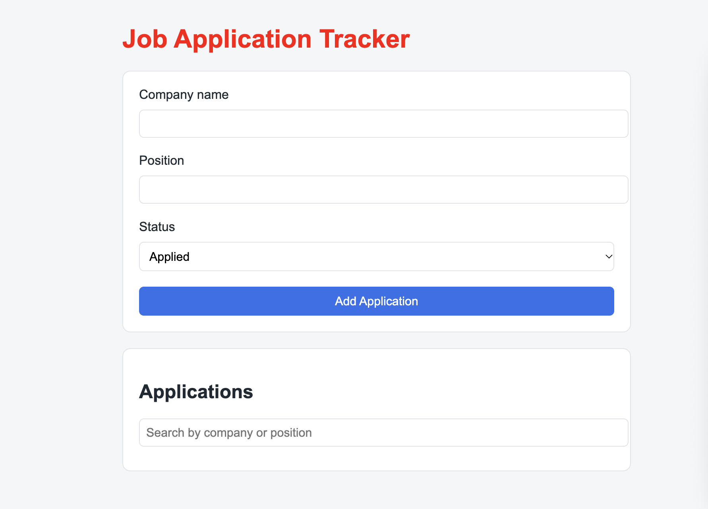

<!--
  README TEMPLATE — Job Application Tracker
  Copy this into your project's README.md and fill in every
  [bracketed] section. Delete these instructional comments once
  you're done. Aim for something a stranger could read and
  immediately understand what your project does and how to try it.
-->

# Daryl — Job Application Tracker

[One or two sentences: what does this app do, and who is it for?
 Example: "A simple web app that helps remote job seekers keep
 track of every application they've submitted, in one place."]

🔗 **Live demo:** [My Vercel Project](https://cavendish-rw-final-project.vercel.app/)

<!-- Add a real screenshot file to your repo and update the path above. -->

## Features

- [ ] Add a job application (company, position, date, URL, status)
- [ ] View all applications
- [ ] Update an application's status
- [ ] Delete an application
- [ ] Search / filter applications
- [ ] Data saved in the browser (localStorage) — survives a refresh
- [ ] Works on both mobile and desktop

<!-- Check off (- [x]) whichever of these you actually built, and
     remove any bonus features you didn't attempt, or list them
     under a "Bonus features" heading below. -->

## Built with

- HTML
- CSS
- JavaScript (no frameworks)
- Git & GitHub for version control
- Deployed with Vercel

## Running this project locally

1. Clone this repository: `git clone https://github.com/daryllukas/cavendish-example-repo`
2. Open `index.html` in your browser — no build step or install required.

## What I learned / challenges I faced

[2-4 sentences, honestly. What was genuinely hard? What clicked
 for you? This section is often the most interesting part of a
 beginner project's README — don't skip it.]

## Future improvements

[A short list of things you'd add or change if you kept working on
 this. This is a normal, expected section — no finished project is
 ever really "finished."]

## Author

Daryl Lukas — built as the final project for the Cavendish University Remote Work Programme, Software Development module.
